# A test assignment from HUAWEI to a "LLM Training Acceleration" team.
The task is to perform the comparison of recent optimization strategies ([AdamW](https://docs.pytorch.org/docs/stable/generated/torch.optim.AdamW.html), [Muon](https://docs.pytorch.org/docs/stable/generated/torch.optim.Muon.html), and *[MeZO](https://github.com/princeton-nlp/MeZO) as challenge*) by **training time**, **maximum memory usage**, **final model quality**, and **training convergence**:
1) Download:
    * From Hugging Face: [Qwen2.5-0.5B](https://huggingface.co/Qwen/Qwen2.5-0.5B) model, training dataset [openwebtext-100k](https://huggingface.co/datasets/Elriggs/openwebtext-100k);
    * From GitHub: evaluation dataset [piqa, arc_easy, arc_challenge, winogrande, hellaswag](https://github.com/EleutherAI/lm-evaluation-harness) and [MeZO](https://github.com/princeton-nlp/MeZO) optimizer.
2) Perform ***full fine-tuning*** of the model with the following optimizers (using at least 1% of training dataset):
    * [AdamW](https://docs.pytorch.org/docs/stable/generated/torch.optim.AdamW.html);
    * [Muon](https://docs.pytorch.org/docs/stable/generated/torch.optim.Muon.html);
    * Improve  Muon  quality  with  a  combination  of  Muon  and  AdamW.  Model parameters are split into 2 groups. The first part of the model is trained with Muon, and the second part is trained with AdamW.;
    * [***Challenge***] [MeZO](https://github.com/princeton-nlp/MeZO).
3) Compare  **training speed**,  **GPU memory usage**, **final model quality** and **training convergence**.
4) Make a **report as a LaTeX** document.
* For more information, see the file `task.pdf`.
* Training logs presented in `task.ipynb` and `/results/<model_name>/history.pkl` files corresponding to specific optimizators.

**Used languages:**
* Python


## Project Structure
    .
    ├── data                                    # folder with data for project
    │   ├── Elriggs/openwebtext-100k            # initial dataset from Hugging Face
    │   │   └── ...
    │   └── Elriggs/openwebtext-100k_processed  # preprocessed and sliced dataset for training
    │       └── ...
    ├── models                                  # folder with project models
    │   └── <model_name>                        # folders for <model_name> model (fine-tuned with different optimizers)
    │       └── ...
    ├── results                                 # folder for results of fine-tuning / evaluation
    │   └── <model_name>                        # folder for results of specific <model_name> model
    │       └── history.pkl                     # log for training / evaluation process of models with optimizator
    ├── images                                  # folder with images
    │    └── ...
    ├── task.ipynb                              # notebook with experiments (appropriate code style)
    ├── task_ru.ipynb                           # draft notebook with comments in russian (code does not follow the style guide)
    ├── finetuning.py                           # .py script for fine-tuning models with different optimizers
    ├── .env                                    # file with CHANGEABLE variables for finetuning.py 
    ├── report.tex                              # report in LaTeX format
    ├── report.pdf                              # report in pdf format
    ├── requirements.txt                        # file with a list of necessary libraries for the project
    ├── task.pdf                                # task description
    └── README.md                               # description file about the project


## Requirements
File `requirements.txt` contains all necessary Python libraries to run a project.

They can be installed with the following command:
```
pip install --user -r requirements.txt
```

Or with creation of **Conda** environment:
```
conda create --name <env_name> python=3.10.19
conda activate <env_name>
pip install -r requirements.txt
```

Or by running the `task.ipynb` file (requires change of **WORKING_DIR** at the head of notebook to *"/path/to/project/location"* and *'pip install'* cell block or change of **USERNAME**, if the launch is on Kaggle ~ see *'How to reproduce experiments'*). 


## How to reproduce experiments
I) On Kaggle:
1) Import notebook `task.ipynb`.
2) Create a dataset (Import on Kaggle) named *'requirements'* with single `requirements.txt` file from this project.
3) Select accelerator for working (GPU T4).
4) Change **USERNAME** variable at the top of notebook to your Kaggle username.
5) Run all cells or press ***Save version*** at top right corner (commit and run, *recommended*).
* ***It is strongly recommended not to run all optimizers at once, but to split them into several sessions, save their results and then compare them in another notebook (since the entire calculation does not fit into the Kaggle quota).***


II) Locally:
1) Download `requirements.txt`.
2) Change **WORKING_DIR** to */path/to/project/location* (e.g., "./") at the top of `task.ipynb` notebook.
3) Comment *'pip install'* cell of notebook.
4) Run cells:
    * All, if the hardware allows.
    * Or run to the desired optimizer (AdamW, Muon, Muon + AdamW), save results as `history.pkl` and run it again for another optimizer (skipping *'Data and model preparation'* block after first launch). As soon as all interesting optimizers save their `history.pkl`, you can go to the final notebook block with a comparison.


## How to use fine-tuning pipeline
1) Download `requirements.txt`.
2) Change variables in `.env` file, ***bold italic names are the most important*** (or don't change, as the simplest fine-tuning with AdamW should work out of the box):
    * ***WORKING_DIR*** — */path/to/project/location*;
    * **DATASET_NAME** — dataset name from Hugging Face for training (*Note, that dataset should include 'train' split and 'text' column*);
    * **MODEL_NAME** — model name for **Causal Machine Learning** from Hugging Face;
    * ***EVAL_BENCHMARKS_TRAINING*** — list of benchmark's names to evaluate model (*if no benchmarks testing is needed — pass []*);
    * ***MAX_SAMPLES*** — max samples from dataset to train and test;
    * ***MAX_SEQUENCE_LEN*** — max generation length (int or "auto" for automatic counting at 95% percentile level);
    * **TEST_SIZE** — test proportion of dataset;
    * **EPOCHS** — epochs for training;
    * **EPOCHS_PATIENCE** — epochs before early stopping if ***TRACKED_METRIC*** don't increase or weights change is too small;
    * **TOLERANCE** — min L2-norm change of weight update to be not "too small";
    * ***LEARNING_RATE*** — step for optimizers;
    * **WEIGHT_DECAY** — L2 regularization coefficient to save model from overfitting;
    * **SCHEDULER_STEP** — after how many epochs should the learning rate decrease;
    * **SCHEDULER_GAMMA** — scheduler coefficient for learning rate;
    * ***BATCH_SIZE*** — how many samples should be sent to the model at a time;
    * **VERBOSE** — how often log training process (e.g. 1 means every epoch);
    * **RANDOM_STATE** — random state for reproducibility;
    * ***FORCE_USE_PREPROCESSED_DATA*** — use a early preprocessed dataset in advance or not (True or False, should be False if **MAX_SAMPLES** / **MAX_SEQUENCE_LEN** / **TEST_SIZE** changed);
    * ***OPTIMIZER*** — desired optimizer ("AdamW", "Muon", "Muon_with_AdamW");
    * ***TRACKED_METRIC*** — metric for early stopping;
    * ***DEVICE*** — device on which fine-tuning will be performed ("cpu", "cuda" or "auto").
3) Run `finetuning.py` script with next command (saves logs):
    ```
    python finetuning.py >> log.txt
    ```


## How to check code style
1) For *notebook*:

    Run next commands *in terminal*, ***specifying <ipynb_file_name>*** (e.g., "nbqa pylint task.ipynb"):
    ```
    nbqa pylint <ipynb_file_name>
    ```
    * For `task.ipynb`: ***Your code has been rated at 8.77/10.***

    and
    ```
    nbqa mypy <ipynb_file_name>
    ```

2) For *.py* files:

    These commands looks like (e.g., "pylint finetuning.py"):
    ```
    pylint <file_name>
    ```
    * For `finetuning.py`: ***Your code has been rated at 9.40/10.***

    and
    ```
    mypy <file_name>
    ```


## Fine-tuning results
### Adam and AdamW definition:
**Adam** optimizer (Adaptive Moment Estimation) — an algorithm for optimizing the weights of neural networks based on the backpropagation of error (gradient) and combining ideas from AdaGrad (***Momentum***) and RMSProp (***individual step for each parameter***). *The algorithm stores in memory two moments (matrices) **for each trainable parameter** of the model*:
1. The first moment (aka the moving average of the gradient, $m_t$) is an analogue of Momentum, which helps not to get stuck in local minima.
2. The second moment (aka the moving average of the square of the gradient, $v_t$) is an analogue of adaptive velocity, it helps to reduce the step where the gradients are very sharp and increase where they are flat.

Their combination allows the optimizer to take larger steps on flat terrain and smaller, careful steps on steep or "noisy" terrain.

***The Adam algorithm*** consists of the following steps (at each iteration $t$, the following calculations are performed for each parameter $\theta$):

0) Initially, at $t=0$, $m_t$ (or $m_0$) and $v_t$ (or $v_0$) for the weight matrices are zero.
1) The gradient $g_t$ (the derivative of the loss function with respect to the current weight $\theta$) is calculated using the formula:
    * $g_t = ∇_{\theta}L(\theta_t)$

    **If L2-regularization is applied** ($\lambda$ is the regularization coefficient, weight decay), then the gradient of $g_t$ is considered as:
    * $g_t = ∇_{\theta}L(\theta_t) + \lambda * \theta_{t-1}$
2) The moments are updated (using exponential attenuation ~ so that the "old" gradients are forgotten and the "new" ones have more weight):
    * $m_t = \beta_1 * m_{t-1} + (1 - \beta_1) * g_t$
    * $v_t = \beta_2 * v_{t-1} + (1 - \beta_2) * g_t^2$ 

    $\beta_1$ (usually 0.9) determines how much we trust past experience. $\beta_2$ (usually 0.999) is responsible for the "memory" of gradient volatility.
3) Bias Correction. Due to the fact that at the very beginning of training $m_t$ and $v_t$ are equal to 0, they "accelerate" for a long time and tend to zero. To fix this, they are scaled (due to which, for small $t>0$, their values are several times larger than they should be, but as $t$ increases, $\beta^t$ decreases, and therefore the scaling factor tends to 1):
    * $\hat{m}_t = \frac{m_t}{1-\beta_1^t}$
    * $\hat{v}_t = \frac{v_t}{1-\beta_2^t}$
4) After scaling, the model weights are updated ($η$ — learning rate, $\epsilon$ — minimum addition so that there is no zero in the denominator):
    * $\theta_{t+1} = \theta_t - η * \frac{\hat{m}_t}{\sqrt{\hat{v}_t} + \epsilon}$

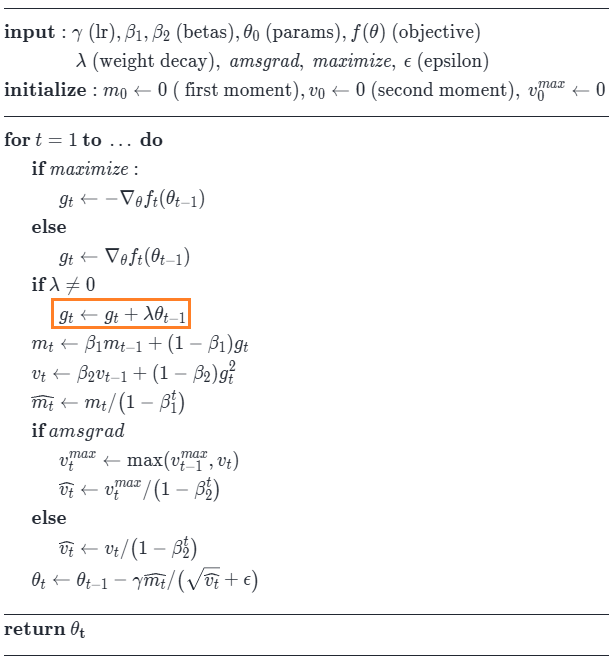 

***The difference between AdamW and Adam lies in the place of application of L2 regularization*** (weight decay). When standard Adam applies regularization directly to gradients (see step 1 of the calculation, which can lead to undesirable effects), ***AdamW does this separately, at the parameter update level***, and not at the gradient level. In this way, AdamW implements the weight decay concept more accurately, which can lead to better learning outcomes. In other words, an additional step is added to AdamW (replacing the moment with L2-regularization).

***The AdamW algorithm:***

0) Initially, at $t=0$, $m_t$ (or $m_0$) and $v_t$ (or $v_0$) for the weight matrices are zero.
1) The gradient $g_t$ (the derivative of the loss function with respect to the current weight $\theta$) is calculated using the formula:
    * $g_t = ∇_{\theta}L(\theta_t)$
2) The moments are updated (using exponential attenuation ~ so that the "old" gradients are forgotten and the "new" ones have more weight):
    * $m_t = \beta_1 * m_{t-1} + (1 - \beta_1) * g_t$
    * $v_t = \beta_2 * v_{t-1} + (1 - \beta_2) * g_t^2$ 

    $\beta_1$ (usually 0.9) determines how much we trust past experience. $\beta_2$ (usually 0.999) is responsible for the "memory" of gradient volatility.
3) Bias Correction. Due to the fact that at the very beginning of training $m_t$ and $v_t$ are equal to 0, they "accelerate" for a long time and tend to zero. To fix this, they are scaled (due to which, for small $t>0$, their values are several times larger than they should be, but as $t$ increases, $\beta^t$ decreases, and therefore the scaling factor tends to 1):
    * $\hat{m}_t = \frac{m_t}{1-\beta_1^t}$
    * $\hat{v}_t = \frac{v_t}{1-\beta_2^t}$
4) **Regularization is applied to weights** $\theta$ ($\lambda$ is the regularization coefficient, weight decay):
    * $\theta_{t+1} = \theta_{t} - η * \lambda * \theta_{t}$
5) The stage of updating the model weights ($η$ — learning rate, $\epsilon$ — minimum addition so that there is no zero in the denominator):
    * $\theta_{t+1} = \theta_{t+1} - η * \frac{\hat{m}_t}{\sqrt{\hat{v}_t} + \epsilon}$

    Steps 4 and 5 can be rewritten as follows:
    * $\theta_{t+1} = \theta_{t} - η * \lambda * \theta_{t} - η * \frac{\hat{m}_t}{\sqrt{\hat{v}_t} + \epsilon}$ 
    * = $\theta_{t} - η * (\lambda * \theta_{t} + \frac{\hat{m}_t}{\sqrt{\hat{v}_t} + \epsilon})$

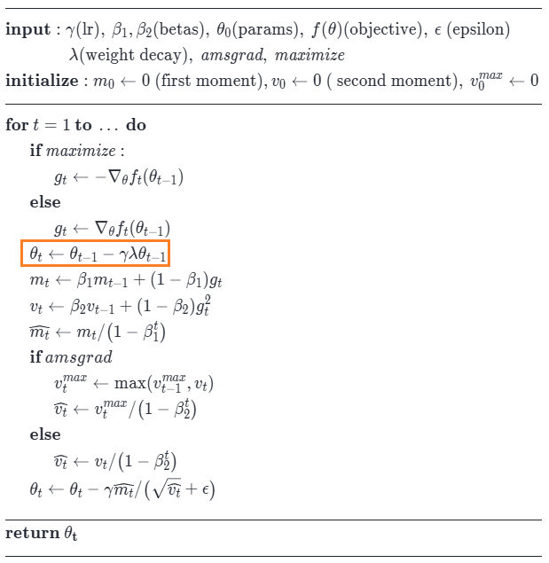

Advantages of the AdamW optimizer:
* Each parameter gets its own effective Learning Rate.
* Due to inertia ($m_t$), the algorithm wags less on noisy data.
* Adam usually converges faster than regular SGD and is less sensitive to the initial learning rate setting.
* Adam almost always works out of the box with default hyperparameters.

### Fine-tuning results with AdamW:
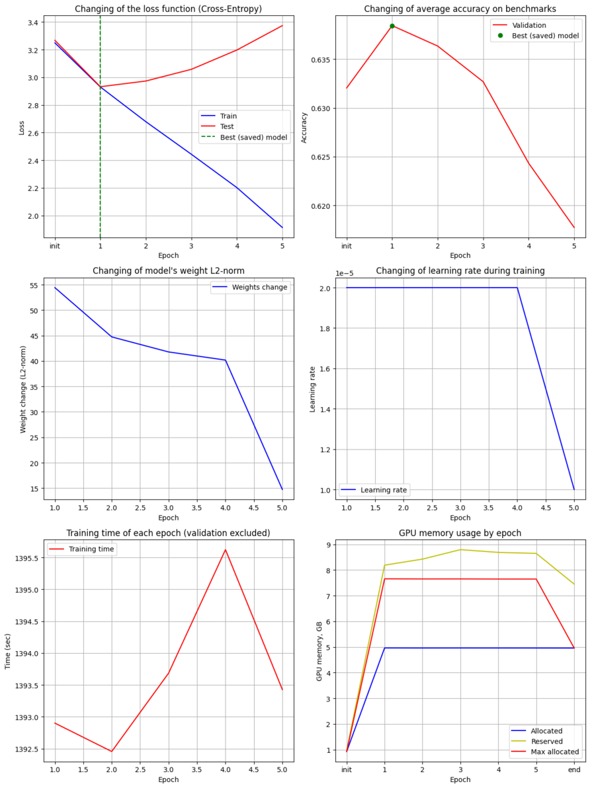 

<br>

### Muon definition:
The **Muon** Optimizer (Momentum Updated Orthogonalized Optimizer) is an algorithm for optimizing the weights of neural networks based on orthogonalization of gradients (bringing the gradient matrix to an orthogonal form, where each column and row are orthogonal (perpendicular) to each other and have a length of 1). While standard optimizers like Adam adapt the step for each weight separately (using the moving average of the square of the gradient), Muon works with entire parameter matrices, trying to make them "as informative as possible", without duplicating information and preserving the spectral properties of the weight matrices.

**Operating principle**: 
Ordinary gradients often contain redundancy, due to which many directions in the weight space are updated almost identically. Muon applies an operation to the gradient matrix that makes it orthogonal (or approximately orthogonal). Muon, like Adam, also uses Momentum ($m_t$, the moving average of the gradient), which helps to avoid getting stuck in local minima. But, unlike Adam, Muon does not store the moving average of the squares of the gradient to adapt the step, which reduces its memory requirements.

***The Muon algorithm:***

0) Initially, at $t=0$, the Momentum $m_t$ (or $m_0$) of the weight matrices is zero.
1) The gradient $g_t$ (the derivative of the loss function with respect to the current weight $\theta$) is calculated using the formula:
    * $g_t = ∇_{\theta}L(\theta_t)$
2) Consideration of Momentum, which makes it possible to smooth out noise and keep the inertia of movement (in a different way than in Adam) to a minimum of the loss function (coefficient $μ$, in Adam it is $\beta_1$ ~ how much do we trust past experience):
    * $m_t = μ * m_{t-1} + g_t$

    If we use Nesterov's Momentum, then:
    * $m_t = μ^2 * m_{t-1} + (1 + μ) g_t$
3) Calculation of orthogonalization of the gradient matrix $O_t$, for which Muon takes the matrix of accumulated gradients and applies the Newton-Schultz iterative procedure to it to obtain an approximation (instead of the classical SVD decomposition, which is computationally expensive):
    * $O_t = NS_k^{(a,b,c)}(m_t; \epsilon)$
    
    Here $(a,b,c)$ are the coefficients of the Newton-Schultz orthogonalization polynomial, $\epsilon$ is the minimum addition so that there is no zero in the denominator.
    
    Due to this, the product of the matrix itself is $OO^T \approx 1$, all singular values of the matrix become equal to 1, which removes the problem of different gradient scales for different layers and parameters.
4) **Appling L2 regularization to weights** ($\lambda$ is the regularization coefficient or weight decay, $η$ — initial learning rate):
    * $\theta_{t+1} = \theta_{t} - η * \lambda * \theta_{t}$
5) Recalculation the update step $η$ (learning rate) depending on the dimension of the weight matrix (so that the orthogonalized update has a consistent RMS value for rectangular matrices) and taking into account the orthogonal gradient matrix for updating the weights:
    * $η = AdjustLR(η; shape(\theta_t))$
    * $\theta_{t+1} = \theta_{t+1} - η * O_t$

    Steps 4 and 5 can be rewritten as follows:
    * $\theta_{t+1} = \theta_{t} - η * \lambda * \theta_{t} - AdjustLR(η; shape(\theta_t)) * O_t$

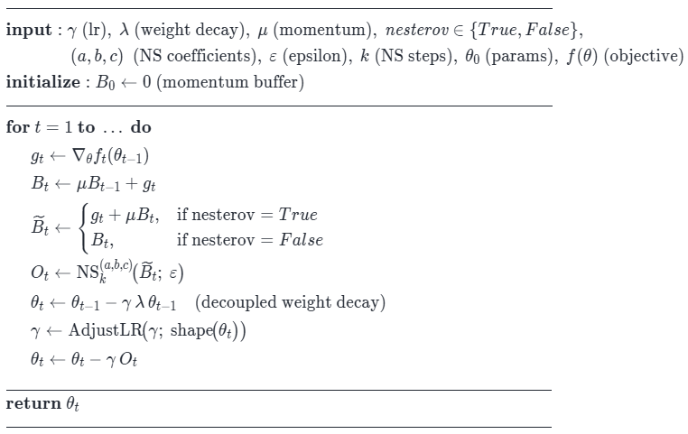

Advantages of the Muon optimizer:
* Aligns the update scale in all singular directions (Muon forces all directions in the scale space to be trained at the same speed, whereas in Adam some directions can "fade out" faster than others).
* Accelerates convergence, as the optimizer does not waste time "rocking" in the narrow canyons of the loss function.
* Allows to use a higher learning rate without losing stability.
* Requires less memory, as it stores only one moving average (for Momentum) instead of two.

Muon is designed specifically for ***two-dimensional weight matrices*** (linear layers), while AdamW is usually used for the rest of the parameters (embedding, normalization, bias).

### Fine-tuning results with Muon:
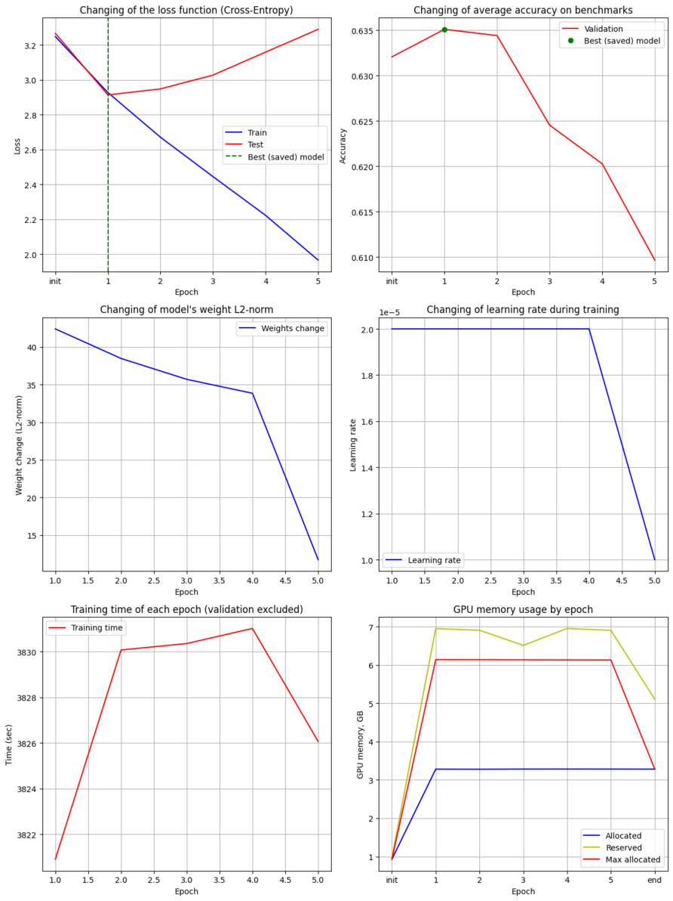 

<br>

### Fine-tuning results with combination of Muon and AdamW:
For an experiment, try to combine both optimizers by splitting model parameters by optimizers. Knowing that Muon only works well with 2D matrices — transfer such matrices to it, and send all other weights to AdamW.
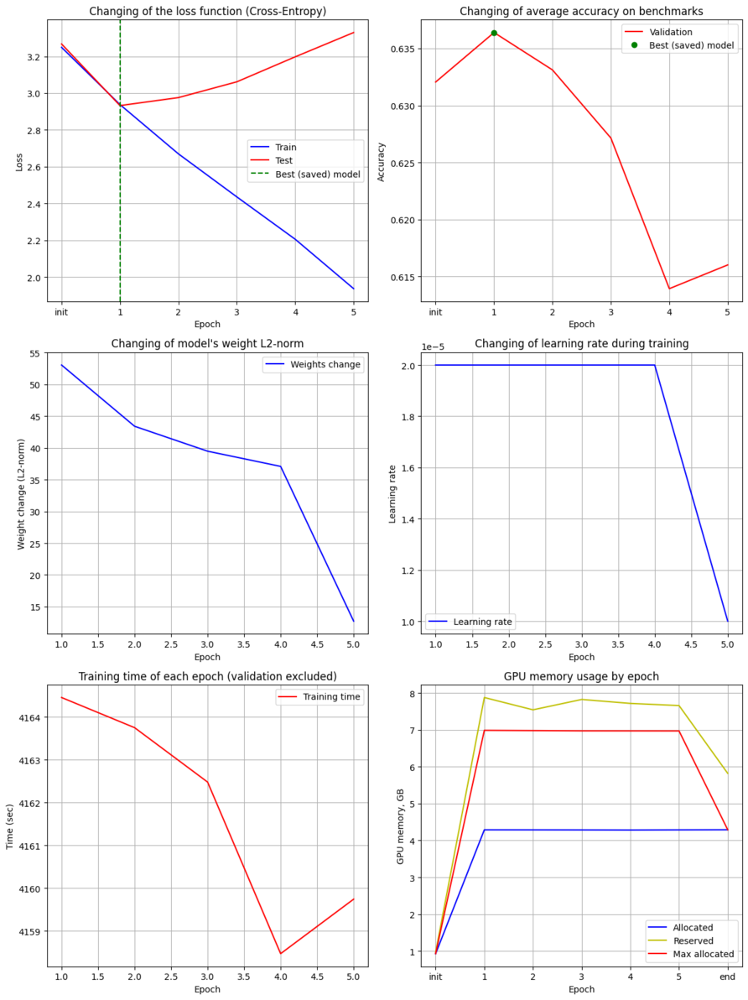 

<br> 

## Results comparison
For a more comprehensive analysis, another experiment was conducted, which included 8000 samples instead of 4000. The training was only with AdamW optimizer (*AdamW_8k*), since other optimizers simply did not fit into the Kaggle quota.


### Cross-Entropy Loss
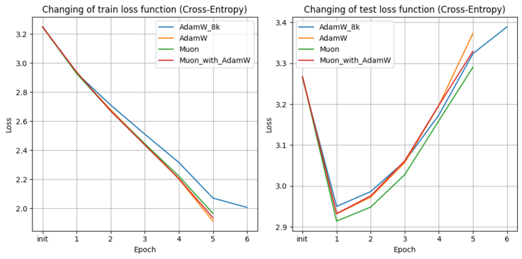 <br> 
When fine-tuning with any optimizer (*including AdamW_8k experiment*), the **change in Cross-Entropy loss**, both on training data and on test data, has approximately the ***same trend. Fast learning with a strong loss decrease on train data, but at the same time overfitting after the first epoch*** (loss on test data has a V-shaped trend). This observation can be explained by the fact that the model is too large for such a small amount of disparate data (even increasing to 8000 samples did not solve the problem).


### Average accuracy on benchmarks subset
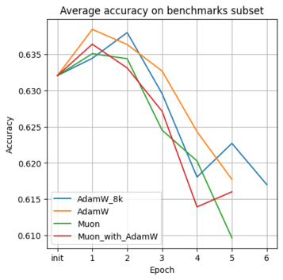 <br> 
The **change in the tracked metric** (average accuracy on subset of benchmarks) also shows a similar ***trend among all experiments, where the metric improves at 1-2 epochs, after which there is a sharp decline due to overfitting***. At the same time, training with AdamW (*AdamW, AdamW_8k, Muon_with_AdamW*) shows slightly higher accuracy than when training only with the Muon optimizer (*it should be clarified that only 72% of the model weights are trained in Muon, whereas in other experiments all 100%*).


### Training time and convergence
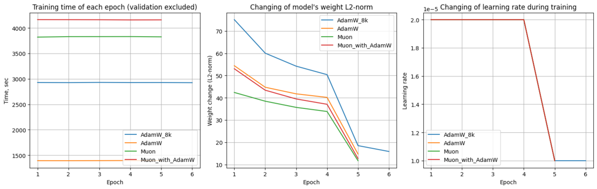 <br> 
The **training time** varies greatly between optimizers, where:
1) ***AdamW optimizer are the fastest*** (even with twice the amount of input data), ~1400 seconds per 4000 samples (23 minutes per epoch) and ~3000 seconds (50 minutes per epoch with 8000 samples). The training time depends almost linearly on the amount of data.
2) The ***Muon*** optimizer, even with only 4000 samples, spent ~ 3,800 seconds per epoch, which is just over an hour and which is almost ***3 times worse than AdamW*** on the same data.
3) ***Combination of Muon with AdamW showed the longest training time*** (~4,100 seconds), since optimization of other weight matrices using AdamW was added to the weights optimized with Muon.

The **change in weights** during training also varies. 
1) ***They changed the least when optimized by the Muon algorithm***, while the value of loss function was comparable to other optimizers. That is, to achieve similar "progress", Muon requires changing the weights by a lower value (while the loss on the test data is even better than that of other optimizers, which cannot be said about the accuracy on benchmarks). 
3) ***The weights changed the most when training with AdamW***, with a 25% more pronounced shift in relation to Muon.
2) Changing the weights with a ***combination of optimizers turned out to be something in between Muon and AdamW***.

*It is also worth to note that with more data, the more the weights of the model changed (according to experiments with 4000 and 8000 samples).*

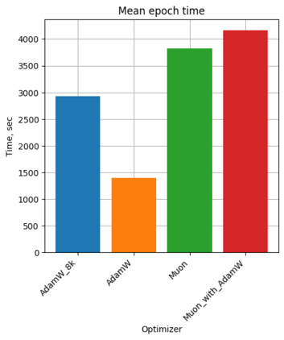 <br> 
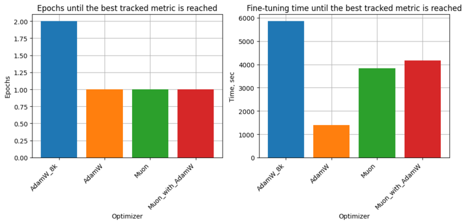 <br> 
***It took only one epoch for the models to be fine-tuned to the best accuracy on the benchmarks*** at 4,000 samples. *If training on more data, then along with the increase of computing time, the accuracy will also be higher.*


### GPU memory usage
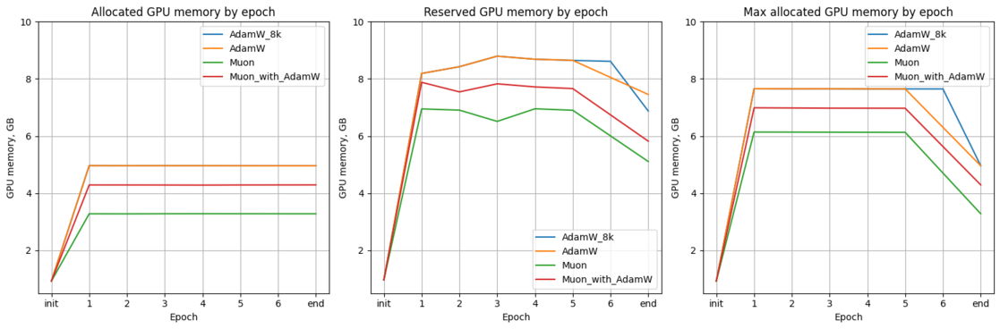 <br> 
Between epochs, GPU memory usage remains almost unchanged (for each optimizer), so proceed to consider the average value of GPU usage.
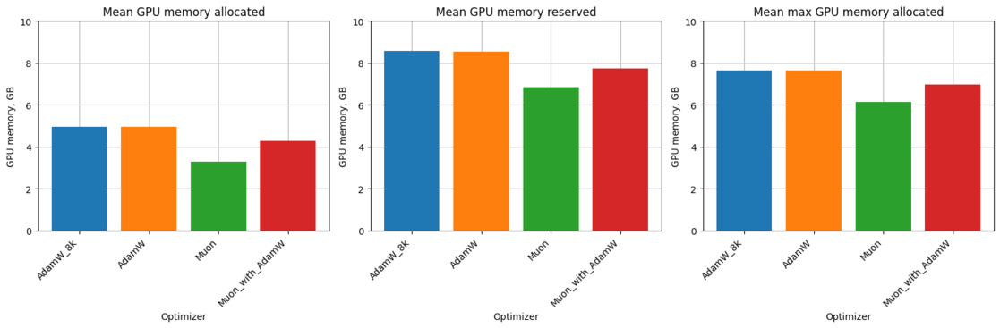 <br> 
Memory usage depends only on the type of optimizer and does not depend on the dataset size (since only a fixed-size batch is loaded at one time).

GPU allocated memory after an epoch:
* ***The highest for the AdamW optimizer***, since it stores two moments at once for each trainable weights (the moving average of the gradients and the moving average of the squares of the gradients). It takes up 3.28 GB with the model.
* After the fine-tuning epoch, ***Muon frees up more memory***, by about 33%, compared to AdamW. Occupying only 3.28 GB with the model.
* The **combination of Muon and AdamW has average consumption** (4.29 GB), after training they take up 15% less memory compared to AdamW, and 30% more when compared with only Muon.

Reserved (cached) GPU memory:
* Similarly, the AdamW optimizer reserves the most memory, 8.55 GB.
* One Muon reserves 20% less memory (6.84 GB).
* The combination of optimizers again has an intermediate value (7.73 GB), 10% less than AdamW, but 13% more than Muon.

**Maximum GPU allocated memory during epoch training**:
* ***AdamW has the highest***, 7.65 GB.
* ***Muon consumes 20% less GPU memory*** (6.13 GB) than AdamW during training.
* The optimizer combination consumes 6.98 GB, which is 9% less and 14% more than AdamW and Muon, respectively.


### Benchmarks
Validation data is the following datasets that evaluate the understanding of the model of physical properties and logical relationships between objects, as well as the possibilities of commonsense reasoning:
1) [PIQA](https://github.com/EleutherAI/lm-evaluation-harness/tree/main/lm_eval/tasks/piqa) (Physical Interaction: Question Answering) — benchmark for determining how well a language model understands the physical properties of objects (*fragility, hardness*) and everyday actions (*how best to wash dishes or place an object*). 
2) [ARC easy](https://github.com/EleutherAI/lm-evaluation-harness/tree/main/lm_eval/tasks/arc) (AI2 Reasoning Easy) — benchmark created to evaluate the ability of artificial intelligence systems to answer questions that require basic scientific knowledge and logic. The set consists of multiple-answer questions taken from real school science exams (grades 3-9). The "Easy" category includes questions that modern (at the time of creation) models could answer using simple statistical methods or keyword search.
3) [ARC challenge](https://github.com/EleutherAI/lm-evaluation-harness/tree/main/lm_eval/tasks/arc) (AI2 Reasoning Challenge) — structurally similar to "ARC easy", but it contains more difficult questions that require "multi-layered" reasoning to answer.
4) [WinoGrande](https://github.com/EleutherAI/lm-evaluation-harness/tree/main/lm_eval/tasks/winogrande) — benchmark designed to evaluate ability of artificial intelligence models to reason based on common sense (commonsense reasoning). The benchmark is based on tasks like the Winograd Schema Challenge (WSC), where model needs to correctly correlate a pronoun with one of two objects mentioned in the sentence. For example, there is an expression "The trophy did not fit in a brown suitcase because *** was too big." The model needs to choose correct answer from a suggested ones. Options: A) Trophy; B) Suitcase. The correct answer is: A (Trophy).
5) [HellaSwag](https://github.com/EleutherAI/lm-evaluation-harness/tree/main/lm_eval/tasks/hellaswag) (Harder Entities, Longer Contexts, and Better Adversarial Filtering) — benchmark created to evaluate the commonsense reasoning abilities of large language models (LLM). The benchmark checks how well the model can predict the most logical outcome of an everyday scenario. Unlike simple tests, HellaSwag uses Adversarial Filtering method: the answer options are generated so that they look plausible to algorithms, but are obviously incorrect to humans. Model gets a context (for example, a description of the beginning of a video clip) and four continuation options. The task is to choose the right one. Tasks are chosen so that they are easy for humans (accuracy ~ 95%), but for a long time remained extremely difficult for AI.

The main metric of all benchmarks is **Accuracy**, that is, the indexes of answers predicted by a model (0, 1, ...) are compared with true label. The higher the Accuracy, the better the model understands essence of the sentence. To do this, CausalLM model is used to estimate logarithmic probability (log-likelihood) of each of the response options. The model "chooses" option that is more likely to be generated with a given context (input).

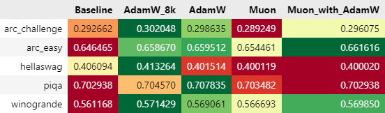 <br> 
Comparing **Accuracy on benchmarks**, it can be seen that:
* ***The best metrics, as expected, were shown by experiment with the largest number of samples*** (8000 versus 4000 for all other optimizers). It surpassed "baseline" (model without fine-tuning) in all benchmarks by 0.2 — 1.2% Accuracy. 
* ***AdamW***, trained on 4,000 samples, ***ranks second*** in terms of Accuracy. He even managed to slightly (by ~0.001 — 0.003, which is less than half a percent) overtake AdamW on "arc_easy" and "piqa" benchmarks.
* ***The combination of optimizers showed the most unstable metrics***, for benchmarks "arc_easy" and "winogrande" there is a relatively good increase in Accuracy, while for "hellaswag" and "piqa" model performed worse than its untrained version.
* One ***Muon showed the worst results***, in two benchmarks it was worse than untrained model ("arc_challenge" and "hellaswag"), and in the other three it was only slightly better ("arc_easy", "piqa", "winogrande").


## Conclusion
* The ***final quality of a model is more influenced by amount of data than a type of optimizer*** (*although fune-tuning with Muon showed almost no improvement in Accuracy*).
* The ***convergence of models with respect to the loss function is almost the same for optimizers***, but not according to L2 norm of updated model's weights, they change the most with AdamW optimizer, the weakest with Muon (*while their loss is almost the same*).
* ***Muon is running much slower*** (*3 times*) than AdamW (*although this may be due to the architecture of a model*).
* ***Muon requires less memory*** (*by ~20% compared to AdamW*), as it stores only one additional matrix for weights (Momentum).
* There are perspectives for Muon related to increasing the batch size and learning rate.
* ***The combination of optimizers shows intermediate results*** in all analysis, except for training time, where fine-tuning took the longest.