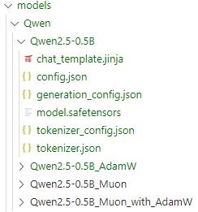

Due to the large size of models (e.g., base [Qwen/Qwen2.5-0.5B](https://huggingface.co/Qwen/Qwen2.5-0.5B) ~ 1GB), they cannot be uploaded to GitHub. However, they should look like this:

They can be downloaded from Hugging Face manually or **created automatically by running experiments** with the specified random state.